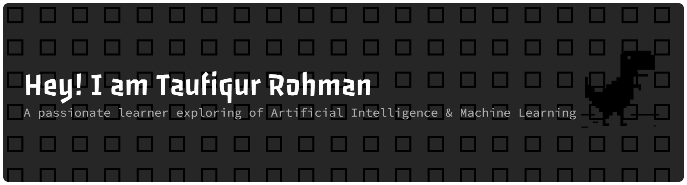

  

<h1 align="center">Hi, I'm Taufiq</h1>

Machine Learning enthusiast focused on practical AI, model building, and clean implementation.

  
  
  

---

### About

I am currently learning Machine Learning and Deep Learning, with a focus on Neural Networks, NLP, and RAG.

I keep this profile simple and practical, with projects and tools that are easy to read and easy to maintain.

### Tech Stack

  
  
  
  
  
  
  
  
  

### Current Direction

- Building a stronger foundation in ML and DL
- Exploring NLP, neural networks, and RAG workflows
- Keeping projects lightweight, readable, and production-minded

### Contribution Graph

<picture>
  <source media="(prefers-color-scheme: dark)" srcset="https://raw.githubusercontent.com/taufiq26127/taufiq26127/pacman-output/pacman-contribution-graph-dark.svg">
  <source media="(prefers-color-scheme: light)" srcset="https://raw.githubusercontent.com/taufiq26127/taufiq26127/pacman-output/pacman-contribution-graph.svg">
  
</picture>
